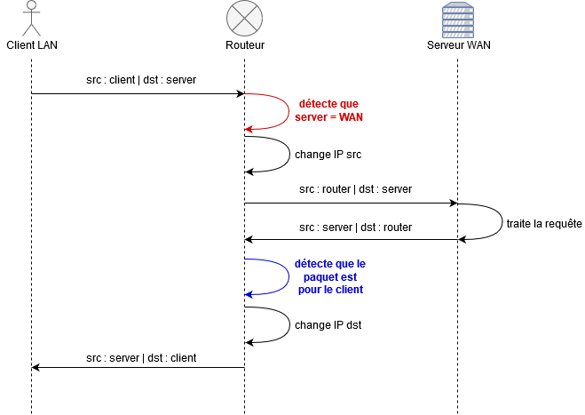

# B2 Réseau - Cours 2

* [Protocoles de transport de données](#protocole-de-transport-de-données)
  * [TCP](#tcp)
  * [UDP](#udp)
* [Adressage IP](#adressage-ip)
  * [LAN/WAN](#lanwan)
  * [Plages d'IP](#plages-dadresses-ip)
  * [Problème posé par les IPs privées](#problème-posé-par-lutilisation-dips-privées)
* [Concept et utilisation du NAT](#concept-et-utilisation-du-nat)
  * [Présentation générale](#présentation-générale)
  * [Table NAT](#table-nat)

# Protocole de transport de données

Les protocoles de transport de données correspondent à la couche 4 du modèle OSI. Ca veut dire que : 
* les proto de transport de données sont encapsulés dans des paquets IPs
* pour rappel les paquets IP sont dans des trames Ethernet

Il existe deux principaux protocoles aujourd'hui largement adoptés à cet effet : TCP et UDP, présentant tous deux avantages et inconvénients.

## [TCP](./lexique.md#tcp--transmission-control-protocol)

[TCP](./lexique.md#tcp--transmission-control-protocol) est le protocole utilisé lorsque :
* on interroge un site en HTTP
* on se connecte à une machine en SSH
* on récupère un fichier sur un partage de fichiers (comme Samba)
* etc.

Il est beaucoup utilisé pour plusieurs raisons : 
* **il garantit l'intégrité de la communication**
  * un *checksum* est présent à la fin de chaque message, attestant que le message n'a pas été altéré
  * le *checksum* est très facile à calculer. Donc c'est pas contre les vilains hackers, c'est au cas où le message ait été altéré pendant son transfert à travers divers support (câbles, WiFi, etc.)
* **il garantit la bonne réception des messages par les pairs**
  * dès qu'une machine reçoit un message en TCP, quelqu'il soit, elle répondra un message `TCP ACK` pour indiquer à son interlocuteur la bonne réception du message
  * c'est un accusé de récéption, ni plus ni moins
* **il garantit la présence de l'interlocuteur**
  * tout au long de l'échange avec les `ACK` (accusés de réception)
  * au début de l'échange avec le *3-way handshake* (un échange de trois messages permettant d'établir une connexion TCP) :

```
1: client ------SYN------> serveur
2: client <---SYN,ACK----- serveur
3: client ------ACK------> serveur
```

> **Il existe 65536 ports TCP sur toutes les interfaces réseau**

## [UDP](./lexique.md#udp--user-datagram-protocol)

[UDP](./lexique.md#udp--user-datagram-protocol) est un protocole utilisé pour de gros flux de données, ou des flux nécessitant beaucoup de performances. Ceci en sacrifiant la qualité et la stabilité de la communication par rapport à TPC.  

L'idée d'UDP est la suivante : 
* aucune garantie d'intégrité
* aucune garantie de la bonne réception des messages par les pairs
* aucune garantie de la présence de l'interlocuteur

Le principal avantage de ne **PAS** ajouter/utiliser ces mécanismes c'est la perf. En effet, les messages `ACK` de TCP par exemple, sont "inutiles" d'un point de vue la communication : ils ne contiennent pas de données. Ce sont donc des messages potentiellement superflus. 

**On peut se permettre d'utiliser UDP pour** : 
* communication qui ne nécessitent de la performance avant tout
  * jeu en ligne
* communication simples, courtes
  * requêtes DNS
  * service de découverte 
    * découverte d'imprimantes sur le réseau par ex
    * c'est juste un truc qui envoie du broadcast m'kay ?
  * NTP
    * protocole utilisé pour la synchronisation au niveau de l'heure en fonction d'un serveur de référence
    * les mises à jour de l'heuer par NTP sont des messages courts et simples
    * pas grave si on perd quelques messages, l'heure sera maintenue en place par la machine elle-même

> **Il existe aussi 65536 ports UDP sur toutes les interfaces réseau**

---

# Adressage IP

## LAN/WAN

De nos jours, on a à faire à deux principaux types de réseau : 
* **LAN** (*Local Area Network*)
  * réseau privé, réseau local
  * comme : réseau de chez vous, réseau d'YNOV
  * permet une communication entre tous les membres du LAN
  * pour passer d'un LAN à un autre réseau, il faut un routeur
  * les machine au sein d'un LAN possèdent des **IPs privées**
* **WAN** (*Wide Area Network*)
  * réseau global, étendu
  * comme : internet
  * le WAN est un gros réseau permettant l'interconnexion de plusieurs LAN
  * c'est un espace public
  * les machines au sein du WAN possèdent une **IP publique**

## Plages d'adresses IP

Inutile de les apprendre par coeur, c'est à titre informatif, voici les principales plages d'adresses IP réservées :
* privées ([RFC 1918](https://tools.ietf.org/html/rfc1918))
  * adresses de tous les LANs du monde
  * `192.168.0.0/16`
  * `10.0.0.0/8`
  * `172.16.0.0/12`
* adresses de bouclages/loopback ([RFC 1122](https://tools.ietf.org/html/rfc1122))
  * `127.0.0.0/8`
* adresses APIPA (adresses auto-configurées en local, [RFC 3927](https://tools.ietf.org/html/rfc3927))
  * `169.254.0.0/16`
* adresses multicast ([RFC 5771](https://tools.ietf.org/html/rfc5771))
  * `224.0.0.0/4`
* le reste (plus ou moins) c'est des adresses publiques m'kay ([référence complète sur l'ami Wikipedia](https://fr.wikipedia.org/wiki/Adresse_IP#Plages_d'adresses_IP_sp%C3%A9ciales))

## Problème posé par l'utilisation d'IPs privées

**ON A UN SOUCIS HOUSTON**
* depuis le LAN il est possible de joindre des IP publiques, grâce à un potentiel routeur et une route par défaut
  * comme chez vous avec votre Box
* **maiiis il est impossible de joindre une IP privée depuis le WAN**
* donc on peut joindre les serveurs du WAN, mais ils ne peuvent pas nous répondre

Par exemple :
```
                                 Passerelle :
     Votre PC                 votre box/routeur            Serveur en ligne
+-----------------+          +-----------------+          +-----------------+
|                 |          |                 |          |                 |
|                 |          |                 |          |                 |
|                 |          |                 |          |                 |
|         10.1.1.1+--------->+10.1.1.254       |          |                 |
|                 |          |                 |          |                 |
|                 |          |      97.45.21.25+--------->+129.2.14.137     |
|                 |          |                 |          |                 |
|                 |          |                 |          |                 |
+-----------------+          +-----------------+          +-----------------+
```
* explication : 
  * votre PC est dans un LAN (il est dans `10.1.1.0/24`, adresse privée)
  * le serveur est dans le WAN (adresse publique)
  * votre passerelle/routeur/box possède une IP de chaque côté (WAN et LAN)

* *votre PC* (`10.1.1.1`) veut contacter un *serveur en ligne* (`129.2.14.137`)
1. il va utiliser sa *route par défaut* qui passe par le routeur du LAN
2. le routeur va faire passer son message sur le WAN, jusqu'au serveur de destination
3. le serveur de destination ne pourra pas répondre : il n'a pas de route vers `10.1.1.0/24`

> **Pour résoudre ce problème, on peut mettre en place du NAT.**

---

# Concept et utilisation du [NAT](./lexique.md#nat--network-address-translation)

## Présentation générale

**Le [NAT](./lexique.md#nat--network-address-translation) (*Network Address Translation*) est une fonction que peut porter un routeur.** Cela permet à des machines avec adresses privées de communiquer avec des machines possédant des IP publiques (passer d'un domaine privé/local à un domaine publique/global).

Le NAT est concept qui a été décliné en de nombreuses implémentations différentes. La plus courante/simple repose sur le transit des datagrammes TCP et UDP (et paquets ICMP, mais on verra plus tard..).

Un client dans un LAN veut joindre un serveur dans un WAN :

<p align="center">
  
</p>

**Explication** : 
1. le client envoie sa requête
    * IP source : client
    * IP destination : serveur WAN
2. **le routeur détecte que le paquet est à destination d'une IP publique** (sur le WAN)
    * parce qu'il voit que l'IP appartient à l aplage publique
3. **il va alors modifier l'IP source du paquet, pour mettre son IP publique**
    * il va aussi créer une ligne dans sa **Table NAT**
    * cette **Table NAT** contient une ligne pour chaque client LAN qui a voulu joindre un serveur WAN
4. la requête est acheminée jusqu'au serveur de destination
    * IP source : router
    * IP destination : serveur WAN
5. le serveur traite la requête
6. il répond à la requête
    * *il répond à celui qui lui a posé la question*
    * IP source : serveur WAN
    * IP destination : router
7. le routeur réceptionne la réponse
    * **le routeur détecte que ce paquet n'est en fait pas pour lui, mais pour un client NAT**
    * il le détecte en regardant sa **Table NAT**
    * il voit que cette connexion correspond à un client
8. **le routeur va modifier l'IP de destination du paquet, pour qu'il arrive jusqu'au client**
9. le message est envoyé au client
    * IP source : serveur WAN
    * IP destination : client

**Notez que l'opération est totalement transparente pour le client**. Son message revient comme il le devrait dans une communication normale : pour le message retout l'IP source est bien celle du serveur, celle de destination est bien la sienne.  

**Les clients, depuis un LAN, peuvent aller sur le WAN (Internet, entre autres) de façon totalement transparente, grâce au NAT.** Boom.

<p align="center">
  
</p>

> il existe deux RFCs au sujet du NAT est ça se lit plutôt bien si vous avez du temps à perdre : [1631](https://tools.ietf.org/html/rfc1631) et [2663](https://tools.ietf.org/html/rfc2663)

## Table NAT

La **Table NAT** utilise les ports ouverts par les clients et leurs IP, ainsi que l'IP et le port du serveur de destination pour identifier de façon unique chacune des connexions. 

> Chaque ligne de la table NAT identifie une connexion d'un client précis, de façon unique. Ca marche parce qu'un client doit ouvrir un port aléatoire **pour chaque connexion** (on peut voir les ports utilisés d'une machine avec la commande [`netstat`](./lexique.md#netstat-ou-ss)).

Exemple de lignes d'une Table NAT : 
```
IP_client:Port_client <---> IP_serveur:port_serveur

# Par exemple
192.168.1.19:37789 <---> 98.2.12.37:443
```
