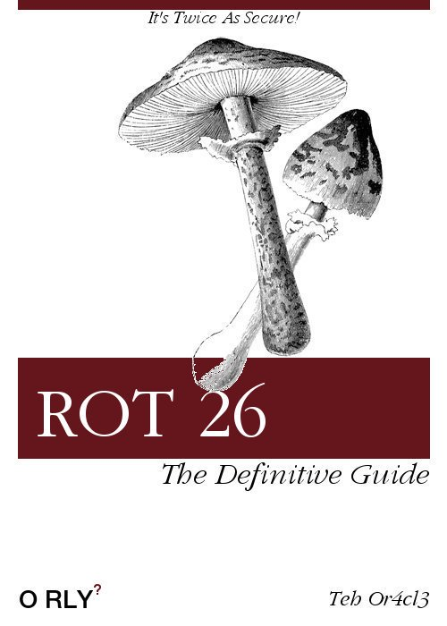

# Crypto Intro

* [I. Encoding (encodage)](#i-encoding)
* [II. Hashing (hachage)](#ii-hashing)
* [III. Encryption (chiffrement)](#iii-encryption)

## I. Encoding

### What ?
L'*encoding* ou *encodage* est le fait d'utilise un *code* pour changer la forme d'un message. C'est une opération très peu coûteuse en performances  
**Encoder un texte n'est pas une sécurité**, et cela ne fait pas partie de la crypto.  
Obligé de le citer ici, parce qu'il est trop confondu avec le reste. 

### Examples
* binaire (base2)
* décimal (base10)
* octal (base8)
* hexadécimal (base16)
* base64 (très utilisé en info pour stocker des petites données)
  * pendant le cours utilisation de `base64` et `base64 -d`
  * **la base64** n'est **PAS** du chiffrement, m'kay ?
* ASCII
* UTF-8

### Why ?
Gagner de la place, économiser du trafic réseau, améliorer les performances, permettre l'interopérabilité.

<br><p align="center">
  
</p>

## II. Hashing

### Vocab
Un *hash* (ou *empreinte* ou *somme de contrôle* ou *checksum*) est le résultat d'un fichier/texte/whatever passé dans une *fonction de hachage*.

### What ?
Ce sont des fonctions mathématiques qui **doivent** respecter certaines propriétés :
* non-réversibilité
  * une *fonction de hachage* est une **one-way function** : on peut la faire dans un sens, mais pas dans l'autre 
  * tout le monde peut calculer le hash de n'importe quel texte
  * personne ne peut retrouver la string correspondat à un hash donné
* il doit être **facile et rapide** de calculer un *hash*
* collision-resistance
  * il doit être difficile de trouver des *collisions*
  * une *collision* c'est quand deux entrées différentes donnent le même *hash*
* non-prédictibilité
  * un tout petit changement dans le message résulte en une altération totale du *hash*
* unicité de l'output ?
  * en théorie, un hash identifie de manière unique une string
    * sauf qu'on a une infinité de strings possibles en entrée
    * pour un nombre fini de strings en sortie
    * donc les collisions existeront toujours avec un tel outil
    * mais à quelle point sont elles faciles à réaliser

### Examples
* [MD5](https://fr.wikipedia.org/wiki/MD5)
  * utilisation de `md5sum` en cours
  * obsolète
* [SHA-1](https://fr.wikipedia.org/wiki/SHA-1)
  * bientôt obsolète
* [SHA-2](https://fr.wikipedia.org/wiki/SHA-2)
  * recommandé
* [SHA-3](https://fr.wikipedia.org/wiki/SHA-3)
  * pas encore implémenté

### Why ?
* **stockage de mot de passe**
  * on stocke le *hash* de l'utilisateur
  * quand il veut se reconnecter
  * on calcule le *hash* du mot de passe saisi
  * et on le compare saisi à l'inscription
  * si ce sont les mêmes alors les mots de passe sont identiques
* **contrôle d'intégrité**
  * lorsqu'un téléchargement est proposé
  * on fournit un fichier à télécharger et son *hash*
  * un client télécharge le fichier
  * une fois téléchargé, il calcule son *hash* et le compare à celui fourni par le site
  * s'ils sont identiques, alors le fichier n'a pas été altéré pendant le transport
* **plein d'autres choses**
  * vérification de l'identité d'un serveur SSH

## III. Encryption

### Vocab
L'*encryption* ou *chiffrement* est l'art de transformer un message en un *message chiffré* ou *ciphertext* à l'aide d'une *clé de chiffrement* en utilisant un  *algorithme de chiffrement*.  

On oppose *message chiffré* à *message en clair*.  

Il existe deux principaux types de chiffrement :
* *symétrique* : la clé pour chiffrer et déchiffrer est la même
* *asymétrique* : il existe deux clés différentes pour chiffrer et déchiffrer  


**Au passage...**
* "*chiffrer*" = transformer un *message* en *ciphertext* avec un *algo de chiffrement* et une *clé*
* "*déchiffrer*" = transformer un *ciphertext* en son *message original*, lorsque l'on connaît l'*algo* et la *clé* utilisée
* "*décrypter*" = démarche de hacker consistant à retrouver le *message original* d'un *ciphertext* sans avoir connaissance de la *clé* et/ou de l'*algo* utilisé pour le *chiffrement*
* "crypter" = chiffrer sans avoir connaissance de l'algo ou de la clé ?...
  * **STRICTEMENT IMPOSSIBLE. PAR DEFINTION.**

---

### What ?
* *chiffrement symétrique* 
  * la *clé* doit être partagée entre tous les membres d'une communication/d'un échange
  * soit partagée IRL, soit envoyée en clair à travers un réseau
  * c'est **très PEU coûteux** en performances (CPU) de chiffrer symétriquement quelque chose

* *chiffrement asymétrique*
  * il existe deux *clés*
  * on peut utiliser n'importe laquelle pour *chiffrer* et l'autre pour *déchiffrer*
  * c'est **très coûteux** en performances (CPU) de chiffrer asymétriquement quelque chose

* utilisation du *chiffrement asymétrique*
  * Un participant (Alice) génère une paire de clés
  * Une qu'elle garde que pour elle et met dans un endroit sécure : *la clé privée*
  * Une qu'elle donne à tout le monde : *la clé publique*

* avec le *chiffrement asymétrique*, il est possible de réaliser principalement deux choses :  
  
**1. Signature**
  * Alice chiffre un message avec sa *clé privée* et l'envoie sur le réseau
  * tout le monde peut le *déchiffrer*
  * mais si le *déchiffrement* marche, alors on est sûrs qu'Alice a envoyé le message
  * c'est de la **signature**  

**2. Echange sécurisé**
  * N'importe qui en possession de la *clé publique* de Alice, par exemple Bob, peut chiffrer un message avec
  * Personne ne pourra ouvrir ce message sauf le détenteur de l'autre *clé*, qui est la *clé privée*
  * C'est Alice qui l'a : seule Alice pour ouvrir ce message

---

### Why ?
* Signature de message
* Echange/Transaction sécurisée
  * échange de *clés symétriques* par exemple dans `https`

---

### Examples de chiffrement
* [*chiffrement par décalage*](https://fr.wikipedia.org/wiki/Chiffrement_par_d%C3%A9calage) (appelé juste "ROT" des fois)
  * *symétrique*
  * la *clé* est le nombre de fois qu'on se décale dans l'alphabet
  * l'*algo de chiffrement* est le *chiffrement par décalage*
  * un cas particulier est connu : avec la clé 13, appelé *chiffrement de César *(*ROT13*)

<br><p align="center">
  
</p>

* *[RSA](https://fr.wikipedia.org/wiki/Chiffrement_RSA)*
  * *asymétrique*
  * initiales des trois chercheurs qui l'ont mis sur pied
  * mais le concept n'avait pas été inventé par eux
  * générer une paire de clés RSA 
```
# Génération de la clé privée (clé de taille 4096 bits)
openssl genrsa -des3 -out private.pem 4096
# Génération de la clé publique qui correspond à la clé privée
openssl rsa -in private.pem -outform PEM -pubout -out public.pem
```

* *[EC](https://fr.wikipedia.org/wiki/Cryptographie_sur_les_courbes_elliptiques)*
  * asymétrique
  * pour *Elliptical Curve*
  * générer une paire de clé EC
```
# Clé privée
openssl ecparam -name secp256k1 -genkey -out priv.pem
# Clé publique
openssl ec -in priv.pem -text -noout
```

<br><p align="center">
  
</p>

## S'il y a un prochain cours de crypto...
* échange DiffieHellman
* explication de RSA
  * démo au tableau
* explication de EC
* deep-dive dans le protocole TLS (le 's' de `https`)
