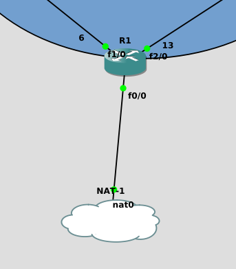

# B2 Réseau 2018 - TP3

# Notions vues avant le TP

* Manipulations IP et masque (avec le [binaire](../../cours/lexique.md#binaire))
* Notions :
  * IP, Ports, MAC
* Utilisation de CentOS
  * installation simple
  * utilisation CLI simple (cf [les commandes du Lexique](../../cours/lexique.md#commandes))
    * `man`, `cd`, `ls`, `nano`, `cat`
    * `ip a`, `ping`, `nc`, `traceroute`, `ss`
  * configuration réseau (voir la fiche de [procédures](../../cours/procedures.md))
    * configuration d'[interfaces](../../cours/lexique.md#carte-réseau-ou-interface-réseau)
    * gestion simplifié de nom de domaine
      * hostname, FQDN, fichier `/etc/hosts`
    * configuration [firewall](../../cours/lexique.md#pare-feu-ou-firewall)
  * utilisation de [`tcpdump`](../../cours.lexique.md#tcpdump)

# TP 3 - Utilisation de matériel Cisco 

Dans ce TP on va mettre en place des topologies un peu plus intéressantes. Pour ce faire on va avoir besoin de :
* **GNS3** : 
  * pour virtualiser des routeurs
* **routeurs**
  * gestion du routage entre les différents réseaux
  * permettre un accès à internet
  * dans tout le TP, les "routeurs" seront des Cisco 3640
* **switches**
  * gestion des VLANs
  * permet aux clients d'accéder au réseau
  * dans tout le TP, les "switches" seront des iOU Cisco

On va mettre en place plusieurs labs pour y aller petit à petit.  

Pour le dernier lab, vous devrez imaginer une topo qui remet en place tout ce qu'on a vu jusqu'à maintenant. Mais si ça va être fun.

# Déroulement et rendu du TP 
* vous aurez besoin de : 
  * [Virtualbox](https://www.virtualbox.org/wiki/Downloads)
  * [GNS3](https://www.gns3.com/)

* les machines virtuelles Linux : 
  * l'OS **devra être** [CentOS 7 (en version minimale)](http://isoredirect.centos.org/centos/7/isos/x86_64/CentOS-7-x86_64-Minimal-1810.iso)
  * pas d'interface graphique (que de la ligne de commande)
  
* les routeurs Cisco :
  * l'iOS devra être celui d'un [Cisco 3640](https://drive.google.com/drive/folders/1DFe2u5tZldL_y_UYm32ZbmT0cIfgQM2p)

* les switches :
  * afin d'utiliser GNS3 comme plateforme pour tous les labs, on utilisera les [iOU dispos sur le même drive]()
  * on va faire l'install ensemble

* les machines virtuelles : 
  * l'OS **devra être** [CentOS 7 (en version minimale)](http://isoredirect.centos.org/centos/7/isos/x86_64/CentOS-7-x86_64-Minimal-1810.iso)
  * pas d'interface graphique (que de la ligne de commande)
  
* il y a beaucoup de ligne de commande dans ce TP, préférez les copier/coller aux screens

* [la forme pour le rendu est décrite sur le README du dossier TP](../README.md)

# Hints généraux

* dans le TP, **lisez en entier une partie avant de commencer à la réaliser.** Ca donne du sens et aide à la compréhension
* **allez à votre rythme.** Le but n'est pas de finir le TP, mais plutôt de bien saisir et correctement appréhender les différentes notions
* **n'hésitez pas à me demander de l'aide régulièrement** mais essayez toujours de chercher un peu par vous-mêmes avant :)
* **utilisez SSH dès que possible**
* **utilisez Wireshark** pour comprendre ce qu'il se passe vraiment sur le réseau, n'attendez plus que je vous dise de le lancer

---

# Sommaire

* [I. Manipulation de switches et de VLAN](#i-manipulation-de-switches-et-de-vlan)
  * [1. Mise en place du lab](#1-mise-en-place-du-lab)
  * [2. Configuration des VLANs](#2-configuration-des-vlans)
* [II. Manipulation simple de routeurs](#ii-manipulation-simple-de-routeurs)
  * [1. Mise en place du lab](#1-mise-en-place-du-lab-1)
  * [2. Configuration du routage statique](#2-configuration-du-routage-statique)
* [III. Mise en place d'OSPF](#iii-mise-en-place-dospf)
  * [1. Mise en place du lab](#1-mise-en-place-du-lab-2)
  * [2. Configuration de OSPF](#2-configuration-de-ospf)
* [IV. Lab Final](#iv-lab-final)
* [Annexe 1 : NAT dans GNS3](#annexe-1--nat-dans-gns3)

---

# I. Manipulation de switches et de VLAN

Dans cette partie on va mettre en place de simples Switches Cisco afin de permettre la connectivité entre plusieurs clients.  

On va aussi mettre en place des VLANs afin d'isoler certaines parties du trafic.  

# 1. Mise en place du lab

#### > Topologie
```
client1           SW1                  SW 2
+----+         +-------+            +-------+
|    +---------+       +------------+       |
+----+         +---+---+            +---+---+
                   |                    |
                   |                    |
                   |                    |
                   |                    |
                +--+-+               +--+-+
                |    |               |    |
                +----+               +----+
               client2               client3
```

#### > Tableau d'adressage

Hosts | `10.1.1.0/24`
--- | ---
`client1.lab1.tp3` | `10.1.1.1/24`
`client2.lab1.tp3` | `10.1.1.2/24`
`client3.lab1.tp3` | `10.1.1.3/24`

#### > Vérification
* [ ] [Nom de domaines](../../cours/procedures.md#changer-son-nom-de-domaine) sur toutes les machines
* [ ] Toutes les machines doivent pouvoir se `ping`

# 2. Configuration des VLANs

Pour la mise en place des VLANs, [référez-vous à la page de procédures Cisco](../../cours/procedures-cisco.md#vlan). Mettez en place les VLANs comme suit : 
* les ports avec un VLAN clairement assigné sont les ports destinés aux clients
  * ce sont les ports **en mode access**
* les ports entre deux switches sont les ports en **mode trunk**
```
client1           SW1                  SW 2
+----+  VLAN10 +-------+    TRUNK   +-------+
|    +---------+       +------------+       |
+----+         +-------+            +-------+
                   |VLAN20              |VLAN10
                   |                    |
                   |                    |
                   |                    |
                +--+-+               +--+-+
                |    |               |    |
                +----+               +----+
               client2               client3

```

#### > Vérification
* [ ] `client1.lab1.tp3` peut joindre `client3.lab1.tp3`
  * `ping` et/ou [`traceroute`](../../cours/lexique.md#traceroute)
* [ ] `client2.lab1.tp3` n'est joignable par personne

---

# II. Manipulation simple de routeurs

Utilisation de routeurs Cisco pour cette partie, on va mettre en place un routage statique simple. Cela permettra à des hôtes dans des réseaux différents de pouvoir se joindre.

## 1. Mise en place du lab

#### > Topologie
```
                           10.2.12.0/30

                  router1                router2
client1          +------+               +------+
+----+.10        |      |.1           .2|      |.254     .10+----+
|    +-----------+      +---------------+      +------------+    |
+----+           +------+               +------+            +----+
                     |.254                                  server1
                     |
                     |
                     |
   10.2.1.0/24       |                         10.2.2.0/24
                     |.11
                  +----+
                  |    |
                  +----+
                  client2

```

#### > Réseau(x)

Nom | Adresse
--- | ---
`lab2-net1` | `10.2.1.0/24`
`lab2-net2` | `10.2.2.0/24`
`lab2-net12` | `10.2.12.0/30`

#### > Tableau d'adressage

Hosts | `lab2-net1` |  `lab2-net2` |  `lab2-net12` 
--- | --- | --- | ---
`client1.lab2.tp3` | `10.2.1.10/24` | x | x
`client2.lab2.tp3` | `10.2.1.11/24` | x | x
`server1.lab2.tp3` | x | `10.2.2.10/24` | x
`router1.lab2.tp3` | `10.2.1.254/24` | x | `10.2.12.1/30`
`router2.lab2.tp3` | x | `10.2.2.254/24` | `10.2.12.2/30`

* pour les IPs des machines Cisco, [référez-vous à la section dédiée dans les procédures Cisco](../../cours/procedures-cisco.md#définir-une-ip-statique)

#### > Vérification
* [ ] les clients et serveurs peuvent joindre leurs gateways respectives
* [ ] les routeurs peuvent discuter entre eux

## 2. Configuration du routage statique

Sur toutes les machines :
* ajouter une route vers `lab2-net1` et `lab2-net2` à toutes les machines qui ne les ont pas déjà
  * [sur une machine CentOS](../../cours/procedures.md#ajouter-une-route-statique)
  * [sur un routeur Cisco](../../cours/procedures-cisco.md#ajouter-une-route-statique)
* **PAS DE ROUTES A AJOUTER VERS `lab2-net12`**
  * vos routeurs connaissent déjà la route, puisqu'ils y sont directement connectés
  * et personne d'autre n'a besoin de la connaître

#### > Vérification
* [ ] tous les clients et serveurs peuvent se joindre

---

# III. Mise en place d'OSPF

Dès qu'on atteint un certain nombre de routeurs, le routage statique atteint très vite ses limites : c'est extrêment long et fastidieux. Par conséquent, c'est un terrain propice à l'erreur humaine et c'est très difficile à maintenir. De plus nous n'avons aucun calcul de route optimale.  

Les protocoles de routage dynamique permettent entre autres de résoudre ces problèmes. Nous étudierons [le protocole OSPF](../../cours/3.md#ospf) dans ce TP. 

## 1. Mise en place du lab

#### > Topologie

<br><p align="center">
  
</p>

#### > Tableau d'adressage

Hosts | `10.3.100.0/30` | `10.3.100.4/30` | `10.3.100.8/30` | `10.3.100.12/30` | `10.3.100.16/30` | `10.3.100.20/30` | `10.3.101.0/24` | `10.3.102.0/24`
--- | --- | --- | --- | --- | --- | --- | --- | --- 
`client1.lab3.tp3` | x | x | x | x | x | x | `10.3.101.10/24` | x 
`server1.lab3.tp3` | x | x | x | x | x | x | x | `10.3.102.10/24` 
`router1.lab3.tp3` | `10.3.100.1/30` | x | x | x | x | `10.3.100.22/30` | x | `10.3.102.254/24` 
`router2.lab3.tp3` | `10.3.100.2/30` | `10.3.100.4/30` | x | x | x | x | x | x 
`router3.lab3.tp3` | x | `10.3.100.5/30` | `10.3.100.9/30` | x | x | x | x | x 
`router4.lab3.tp3` | x | x | `10.3.100.10/30` | `10.3.100.13/30` | x | x | `10.3.101.254/24` | x 
`router5.lab3.tp3` | x | x | x | `10.3.100.14/30` | `10.3.100.17/30` | x | x | x 
`router6.lab3.tp3` | x | x | x | x | `10.3.100.18/30` | `10.3.100.21/30` | x | x 

* pour les IPs des machines Cisco, [référez-vous à la section dédie dans les procédures Cisco](../../cours/procedures-cisco.md#définir-une-ip-statique)

#### > Vérification
* [ ] les clients et serveurs peuvent joindre leurs [gateways](../../lexique.md#passerelle-ou-gateway) respectives
* [ ] les routeurs peuvent discuter entre eux (de point à point)

## 2. Configuration de OSPF

Vous pouvez vous référer à [la section dédiée dans la page de procédure Cisco pour configurer OSPF](../../cours/procedures-cisco.md#définir-une-ip-statique#ospf).  

Sur chaque routeur : 
* activer ospf
* définir un `router-id` qui correspond au numéro du routeur
  * `1.1.1.1` pour `router1.lab3.tp3`
  * `2.2.2.2` pour `router2.lab3.tp3`
  * etc.
* partager **tous** les réseaux auxquels le routeur est connecté 
  * les `/30` et les `/24`
  * avec une commande `network`

Sur le client et le serveur :
* ajouter une route par défaut qui pointe vers leurs [passerelles](../../lexique.md#passerelle-ou-gateway) respectives

#### > Vérification
* [ ] tous les routeurs peuvent se joindre
* [ ] `client1.lab3.tp3` peut joindre `server1.lab3.tp3`

---

# IV. Lab Final

Le dernier lab a pour objectif de remettre en pratique tout ce qui a été vu jusqu'à maintenant.  

**Je vous laisse imaginer une topo pour remttre tout ça en place** mais elle doit :
**1. comporter plusieurs routeurs Cisco**
    * ils doivent utiliser **[OSPF](../../cours/procedures-cisco.md#définir-une-ip-statique#ospf)**
    * une seule aire sera utilisée : l'aire de backbone (area 0)
**2. comporter plusieurs switches Cisco**
    * ils doivent mettre en place des **VLANs** sur tous les port utilisés
      * *access* ou *trunk*
  * comporter plusieurs VLANs
    * au moins 2 : `clients` et `servers`
**3. permettre aux clients du réseau (client et serveurs) d'accéder à Internet grâce à la [fonctionnalité NAT](../../cours/lexique.md#nat--network-address-translation)**
    * cela sera fait avec le NAT de GNS3
    * vous trouverez en [Annexe 1](#annexe-1--nat-dans-gns3) un document pour la mise en place du NAT dans GNS3
    * [la mise en place du NAT avec un routeur Cisco est dispo ici](../../cours/procedures-cisco.md#nat)
**4. comporter un service d'infra**
    * se référer au [TP précédent](../2/README.md#ii-nat-et-services-dinfra)
    * pour accéder à internet, vous devez utiliser le NAT mis en place précédemment
**5. si vous voulez permettre aux clients de joindre le réseau des serveurs, il faudra faire du *routage inter-vlan***
    * c'est stylé et en vrai c'est pas beaucoup de configuration
    * je vous conseille une topologie avec un *router-on-a-stick*

Je vous conseille de vous organiser pour ne pas que ce soit l'enfer
  * faites des configurations peristentes partout (pour pas tout perdre en cas de reboot)
  * utilisez un outil comme [draw.io](https://www.draw.io/) et faites un schéma de votre topologie
  * faites un tableau d'adressage IP
  * *faites tout ça, sinon, vraiment, c'est une torture le réseau*

**N'hésitez pas à me soumettre votre topologie avant de vous lancer.**

---

:fire: :fire: :fire: GG. On voit ce genre de petites infras un peu partout dans le monde réel. Il manque encore quelques éléments, mais on est très proches d'une infra réelle petite échelle. :)  :fire: :fire: :fire: 

---

# Annexe 1 : NAT dans GNS3

**Il faut la GNS3 VM.**  

Une fois la GNS3 VM allumée et votre lab ouvert :
* cherchez l'appareil "NAT" dans la liste des devices de GNS3
  * c'est un pitit nuage
  * drag'n'drop dans la topologie

Faites en sorte d'avoir ça :

<p align="center">
  
</p>

* ce routeur va donc nous servir de "machine-pivot" pour permettre à tout le monde d'accéder à internet
  * = ce routeur va faire du NAT
* d'abord, configuration IP : 
```
# show ip int br

# repérez l'interface qui est branchée au NAT. Dans la suite nous supposerons que c'est fastEthernet 0/0. Elle n'a pas encore d'IP.

# conf t
(config)# interface fastEthernet 0/0
(config-if)# ip address dhcp
(config-if)# no shut

# c'est le principe du NAT dans GNS3 : vous allez récupérer une IP automatiquement, et la machine sera capable de faire du NAT. 

# attendez un peu (ou spammez la commande) puis :
# show ip int br

# vous devriez avoir récup une IP, et vous devriez ping google, grâce à votre nouvelle passerelle par défaut

# pour voir la passerelle
# show ip route

# ping google
# ping 8.8.8.8

# à YNOV, on peut pas ping vers l'extérieur (ou maintenant si ?)
# donc on va faire un curl ?
# sauf qu'il n'y a pas de curl ou ce genre d'outils sur un routeur Cisco donc on va faire une requête HTTP à la main
# conf t

# Activation du lookup DNS
(config)# ip domain-lookup

# Configuration du serveur DNS (celui de google)
(config)# ip name-server 8.8.8.8

# Requête web vers un site full HTTP, avec résolution de nom
(config)# exit
# telnet trip-hop.net 80
GET /

# Vous devriez récup de l'HTML en masse ou une erreur HTTP
```